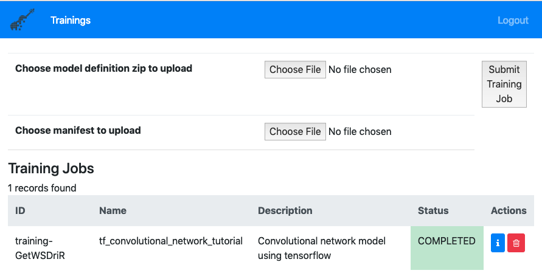

# Deep Learning Model Training with FfDL running on Minishift

[FfDL](https://github.com/IBM/FfDL), fabric for deep learning, is an open source collaboration platform runs on public or private cloud and provides training, monitoring and management of deep learning models. FfDL runs as scalable microservices with Kubernetes, including RESTful API service, trainer service, training data service, and lifecycle management and learner pods. In fact, FfDL is one of the [2018 Best of Open Source Software Award](https://www.infoworld.com/article/3308398/machine-learning/the-best-open-source-software-for-machine-learning.html?nsdr=true#slide12) winners in machine learning and deep learning. It is also the core of IBM Watson Machine Learning service.

With FfDL's rich support of deep learning frameworks, including TensorFlow, PyTorch, ONNX and more, data scientists can focus on developing the model training code, as well as compare the models trained with different frameworks. Better yet, FfDL can run locally on a Kubernetes cluster inside a VM. This gives users great flexibility and cost efficiency to develop the deep learning models before going to cloud.

In this tutorial, we will show how to deploy FfDL on [Minishift](https://github.com/minishift/minishift).

Minishift runs Red Hat [OpenShift](https://www.openshift.com/) Kubernetes platform locally. It uses [OpenShift Origin](https://github.com/openshift/origin) to run the cluster. Data scientists can try out the development and training on a Minishift cluster before deploying and serving the models to an OpenShift cluster.

## - Install Minishift cluster

We start with installation of a Minishift cluster on a local host. Our host machine has **CentOS 7.6** base Linux operating system.

The [Getting Started with MiniShift](https://docs.okd.io/latest/minishift/getting-started/index.html) has detailed documentation on how to install a Minishift cluster. It also includes the instructions to set up `virtualbox` or `KVM` hypervisors. Depends on the different base Linux platforms, installation of hypervisor are different. Sometime either the hypervisor installation fails or Minishift cluster fails to start with one of the hypervisor.

So instead of running a Minishift cluster with a hypervisor, following provides the step by step instruction to run the cluster with a `generic` hypervisor, also supported by Minishift.

1. Install docker

```command line
yum install docker -y
systemctl restart docker
```

2. Generate ssh key if not yet. The ssh key is needed to start the Minishift cluster

```command line
ssh-keygen -t rsa -N "" -f ~/.ssh/id_rsa
ssh-copy-id root@localhost 
```

3. Install Minishift executable following the [link](https://github.com/minishift/minishift/releases) and choose a release, for example, *1.31.0*.

```command line
curl -L -o minishift.tgz https://github.com/minishift/minishift/releases/download/v1.31.0/minishift-1.31.0-linux-amd64.tgz
tar zxvf minishift.tgz
cp minishift*linux*/minishift /usr/local/bin
```

Once complete the simple steps above, go forward to starting the Minishift cluster with following command:

```command line
export VM_IP=<vm_ip_address>
minishift start --vm-driver=generic --remote-ipaddress=$VM_IP --remote-ssh-user=root --remote-ssh-key=/root/.ssh/id_rsa --cpus <num_cpus> --memory <memory_size> --disk-size <disk_size>
```

replace `<vm_ip_address>` with the IP address for the host, `<num_cpus>` with the number of cores to reserve for the cluster, `<memory_size>` with the max memory to be consumed by the cluster and `<disk_size>` with the size of the disk space for the cluster.

Note, during Minishift cluster is starting, it needs to download from some github repo, and if `403 API rate limit` error is observed, setting following environment variable and submit the command to start the cluster again.

```command line
export MINISHIFT_GITHUB_API_TOKEN=<github_access_token>
```

replace the `<github_access_token>` with a real github personal access token. Follow this [link](https://help.github.com/articles/creating-a-personal-access-token-for-the-command-line/) to create one if needed.

As part of the Minishift start process, OpenShift `oc` command is added to the `/var/lib/minishift/bin` directory, add the directory to the `PATH` environment variable.

```command line
export PATH=$PATH:/var/lib/minishift/bin
```

## - Prepare one PersistentVolume

Minishift creates 100 `PersistentVolume`s when the cluster starts. We will claim one of these PVs to store the FfDL training job info.

To work around an OpenShift `subPath` issue as described [here](https://github.com/openshift/origin/issues/21404), we will remount the local `tmpfs` file system used by Minishift for storing data. 

```command line
mount --bind --make-rshared /var/lib/minishift/base/openshift.local.pv/pv0001 /var/lib/minishift/base/openshift.local.pv/pv0001
```

Restart the Minishift cluster

```comamnd line
minishift stop
minishift start --vm-driver=generic --remote-ipaddress=$VM_IP --remote-ssh-user=root --remote-ssh-key=/root/.ssh/id_rsa --cpus <num_cpus> --memory <memory_size> --disk-size <disk_size>
```

## - Deploy FfDL service

After the Minishift cluster starts, the default project `myproject` is created. This is also the namespace where the FfDL service will be deployed. We need to make some tweaks to the instructions in the FfDL project [link](https://github.com/IBM/FfDL/tree/helm-patch) so that FfDL can be deployed on a Minishift cluster. Following are step by step instructions.

1. Login as admin

```command line
oc login -u system:admin
```

2. Install [`helm`](https://docs.helm.sh/using_helm/) as FfDL uses `helm charts` to install its services

```command line
curl https://raw.githubusercontent.com/helm/helm/master/scripts/get > get_helm.sh
chmod 700 get_helm.sh
./get_helm.sh
```

3. Create the `tiller` service account

```command line
cat <<EOF > sa.yaml
apiVersion: v1
kind: ServiceAccount
metadata:
  name: tiller
  namespace: kube-system
---
apiVersion: rbac.authorization.k8s.io/v1beta1
kind: ClusterRoleBinding
metadata:
  name: tiller
roleRef:
  apiGroup: rbac.authorization.k8s.io
  kind: ClusterRole
  name: cluster-admin
subjects:
  - kind: ServiceAccount
    name: tiller
    namespace: kube-system
EOF

oc apply -f sa.yaml
helm init --service-account tiller --upgrade
```

4. Create permissive RBAC policy to allow all service accounts to act as cluster administrators

```command line
oc create clusterrolebinding permissive-binding \
  --clusterrole=cluster-admin \
  --user=admin \
  --user=kubelet \
  --group=system:serviceaccounts
```

5. Install s3fs as it is used by FfDL to mount S3 buckets

```command line
yum install -y epel-release
yum install -y s3fs-fuse
ln -s /usr/bin/s3fs /usr/local/bin/s3fs
```

6. Clone the FfDL repository since we will run the `helm charts` from within the repository

    Install `git` if not yet installed:

    ```command line
    yum install -y git
    ```

    Clone FfDL github repo and checkout `helm-patch` branch:

    ```command line
    git clone https://github.com/IBM/FfDL.git
    cd FfDL
    git checkout helm-patch
    ```

7. Deploy FfDL service

    Before deploy, we need to set two environment variables.

    ```command line
    export NAMESPACE=<myproject>
    export SHARED_VOLUME_STORAGE_CLASS=""
    ```

    replace `<myproject>` with the namespace where FfDL will be installed.

    * Install object storage plugin
    
    ```command line
    helm install docs/helm-charts/ibmcloud-object-storage-plugin-0.1.tgz --name ibmcloud-object-storage-plugin --set namespace=$NAMESPACE,cloud=false
    ```

    * Install FfDL helper

    ```command line
    helm install docs/helm-charts/ffdl-helper-0.1.1.tgz --name ffdl-helper --set namespace=$NAMESPACE,shared_volume_storage_class=$SHARED_VOLUME_STORAGE_CLASS,localstorage=true,prometheus.deploy=false --wait
    ```

    * Install FfDL core pods

    ```command line
    helm install docs/helm-charts/ffdl-core-0.1.1.tgz --name ffdl-core --set namespace=$NAMESPACE,lcm.shared_volume_storage_class=$SHARED_VOLUME_STORAGE_CLASS --wait
    ```

8. Modify FfDL PVC to consume resource from Minishift's PV

    After FfDL is installed, it by default creates a PersistentVolume `local-volume-1` and a bound PersistentVolumeClaim `static-volume-1`. Train jobs won't be able to start with this PVC due to the `subPath` [issue](https://github.com/openshift/origin/issues/21404) mentioned above. So we need to recreate the PersistentVolumeClaim to use the remounted `pv0001`.

    First delete the default PV and PVC.

    ```command line
    oc delete pvc static-volume-1
    oc delete pv local-volume-1
    ```

    Then recreate the `static-volume-1` PVC.

    ```command line
    cat <<EOF > pvc-config.yaml
    kind: PersistentVolumeClaim
    apiVersion: v1
    metadata:
        name: static-volume-1 
        namespace: myproject
        annotations:
            volume.beta.kubernetes.io/storage-class: 
        labels:
            type: dlaas-static-volume
    spec:
        selector:
            matchLabels:
                volume: pv0001
        accessModes:
            - ReadWriteMany
        resources:
            requests:
                storage: 20Gi

    ---
    kind: ConfigMap
    apiVersion: v1
    data:
        PVCs-v2.yaml: |
            static-volumes-v2:
                - name: static-volume-1
                  zlabel: static-volume-1
                  status: active
    metadata:
        name: static-volumes-v2
        namespace: myproject
    EOF

    oc apply -f pvc-config.yaml
    ```

Once all steps succeed, the FfDL is fully installed and is ready to accept model training jobs.

Run following commands to get the URL link to the FfDL UI:

```command line
ui_port=$(oc get service ffdl-ui -o jsonpath='{.spec.ports[0].nodePort}')
restapi_port=$(oc get service ffdl-restapi -o jsonpath='{.spec.ports[0].nodePort}')
node_ip=$(minishift ip)
echo "Web UI: http://$node_ip:$ui_port/#/login?endpoint=$node_ip:$restapi_port&username=test-user"
```

Paste the URL to a web browser and you are ready to submit your first training job through FfDL. 

## - Obtain access to a cloud object store

FfDL loads train data from and stores the models to a cloud object store. If you do need to set up your own S3 type of cloud storage, deploying a [Minio](https://docs.minio.io/) server is a quick.

```command line
oc create -f https://github.com/minio/minio/blob/master/docs/orchestration/kubernetes/minio-standalone-pvc.yaml?raw=true
oc create -f https://github.com/minio/minio/blob/master/docs/orchestration/kubernetes/minio-standalone-deployment.yaml?raw=true
oc create -f https://github.com/minio/minio/blob/master/docs/orchestration/kubernetes/minio-standalone-service.yaml?raw=true
```

Once the service is up, run following to retrieve the URL link:

```command line
echo http://$(minishift ip):$(oc get service minio-service -o jsonpath='{.spec.ports[0].nodePort}')
```

Copy the URL to a web browser will open up the access to the Minio service. The `access_key` and `secret_access_key` are default to `minio` and `minio123` as they are saved in the [deployment.yaml](https://github.com/minio/minio/blob/master/docs/orchestration/kubernetes/minio-standalone-deployment.yaml?raw=true) file.

With all preparation done above, we can now run some serious deep learning model training. Following we will show a couple of model training examples.

## - Train handwriting recognition model with TensorFlow through FfDL

This deep learning model train code can be retrieved from FfDL [github](https://github.com/IBM/FfDL/tree/master/etc/examples/tf-model) or [here](files/FfDL-example).

FfDL UI takes a model train code in a `zip` format file and a `manifest` in `yaml` format file to kick off a training job. To try out this example, run following command to compress the TensorFlow code:

```command line
pushd tf-model
zip -j tf-model convolutional_network.py input_data.py
popd
```

