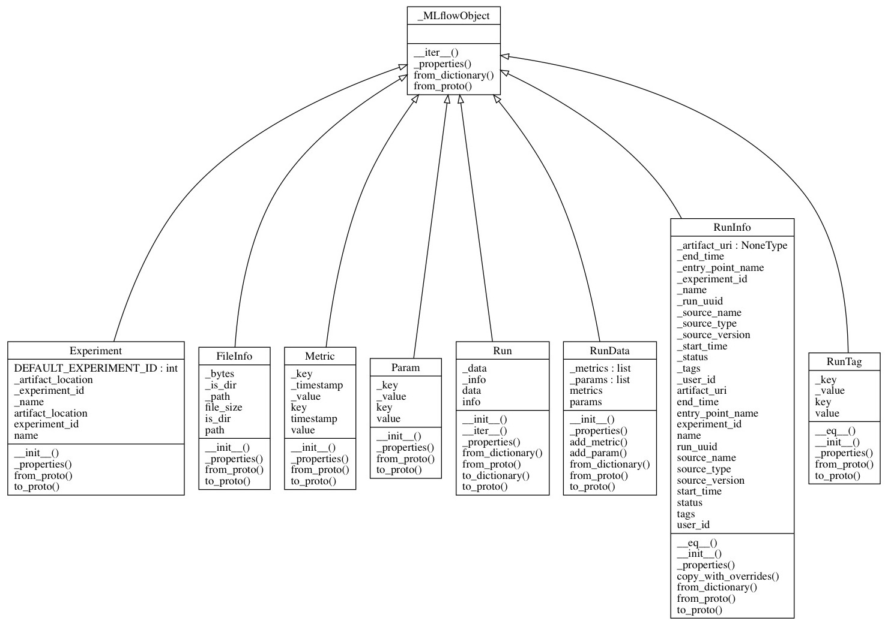
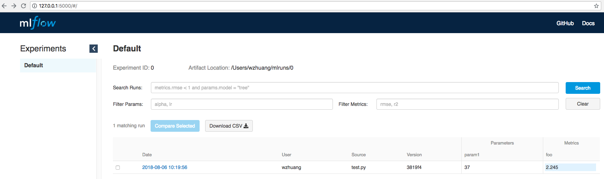
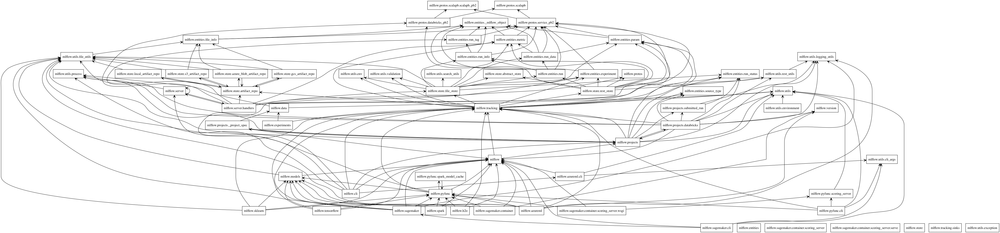

# First Impression on MLflow

[***MLflow***](https://mlflow.org/) is one of the latest open source projects added to the [**Apache Spark**](https://spark.apache.org/) ecosystem by [databricks](https://databricks.com/). It first debut in the [Spark + AI Summit 2018](https://databricks.com/session/unifying-data-and-ai-for-better-data-products). The source code is hosted in the [mlflow-github](https://github.com/databricks/mlflow) and is still in the alpha release stage. The current version is 0.4.1 released on 08/03/2018.

Blogs and meetups from databricks describe *MLflow* and its roadmap, including [Introducing MLflow: an Open Source Machine Learning Platform](https://databricks.com/blog/2018/06/05/introducing-mlflow-an-open-source-machine-learning-platform.html) and [MLflow: Infrastructure for a Complete Machine Learning Life Cycle](https://www.slideshare.net/databricks/mlflow-infrastructure-for-a-complete-machine-learning-life-cycle). Users and developers can find useful information to try out *MLflow* and further contribute to the project.

This blog, however, will show the values of *MLflow* and describe the internals of the *MLflow* based on the firsthand experience and the study of the source code. It will also look for places *MLflow* can be enhanced by some comparison with other similar projects.

## What is MLflow
***MLflow*** is targeted as an open source platform for the complete machine learning lifecycle. A complete machine learning lifecycle at least includes raw data ingestion, data analysis and preparing, model training, model evaluation, model deployment and finally model maintenance. *MLflow* is built as a Python package and provides open REST APIs and commands to

* log important parameters, metrics and other data that are mattered to the machine learning model
* track the environment a model is run on 
* run any machine learning codes on that environment 
* deploy and export models to various platforms with multiple packaging formats 

*MLflow* is implemented as several modules, where each module supports a specific function.

### MLflow components
Currently *MLflow* has three components as follow (source: [Introducing MLflow: an Open Source Machine Learning Platform](https://databricks.com/blog/2018/06/05/introducing-mlflow-an-open-source-machine-learning-platform.html))


Further description of each component can be found in the blog mentioned above and the link to the [*MLflow* Documentation](https://mlflow.org/docs/latest/index.html). Rest of the section will give a high level overview of the internals and implementation of each component. 

#### Tracking
Tracking implements REST APIs and UI for parameters, metrics, artifacts and source logging and viewing. The backend is implemented with [Flask](http://flask.pocoo.org/) and run on [gunicorn](http://gunicorn.org/) HTTP server while the UI is implemented with [React](https://reactjs.org/).

The Python module for tracking is `mlflow.tracking`.

Every time users train a model on the machine learning platform *MLflow* creates a `Run`  and save the `RunInfo` meta info onto disk. Python APIs are provided to log parameters and metrics for a `Run`. The output of the run such as the model are saved in the `artifacts` for a `Run`. Each individual `Run` is grouped into an `Experiment`. Following class diagram shows classes defined in *MLflow* to support tracking function.


The model training source code needs to call *MLflow* APIs to log the data to be tracked. For example, calling `log_metric` to log the metrics and `log_param` to log the parameters.

*MLflow* tracking server currently uses file system to persist all `Experiment` data. The directory structure looks like below:
```
mlruns
└── 0
    ├── 7003d550294e4755a65569dd846a7ca6
    │   ├── artifacts
    │   │   └── test.txt
    │   ├── meta.yaml
    │   ├── metrics
    │   │   └── foo
    │   └── params
    │       └── param1
    └── meta.yaml
```

Every `Run` can be viewed through UI browser that connects to the tracking server. 


Users can search and filter models with `metrics` and `params`, and compare and retrieve model details.

#### Projects
Projects component defines the specification on how to run the model training code. It includes the platform configuration, the dependencies, the source code, the data and others that allows the model training to be executed through *MLflow*. Following is an example provided by the *MLflow*:
```
name: tutorial

conda_env: conda.yaml

entry_points:
  main:
    parameters:
      alpha: float
      l1_ratio: {type: float, default: 0.1}
    command: "python train.py {alpha} {l1_ratio}"
```

The `mlflow run` command looks for `MLproject` file for the spec and download the dependencies if needed, then runs the model training with the source code and data specified in the `MLproject`. 
```
mlflow run mlflow/example/tutorial -P alpha=0.4
```

The `MLproject` specifies the command to run the source code, therefore, the source code can be in any languages, including Python. Projects can be run on many machine learning platforms, including tensorflow, pyspark, scikit-learn and others. If the dependent Python packages are available to download by Anaconda, they can be added to `conda.yaml` file and *MLflow* will set up the packages automatically.

#### Models
Models component defines the general model format in the `MLmodel` file as follow:
```
artifact_path: model
flavors:
  python_function:
    data: model.pkl
    loader_module: mlflow.sklearn
  sklearn:
    pickled_model: model.pkl
    sklearn_version: 0.19.1
run_id: 0927ac17b2954dc0b4d944e6834817fd
utc_time_created: '2018-08-06 18:38:16.294557'
```
It specifies different `flavors` for different tools to deploy and load the model. This allows the model to be saved in its original binary persistence output from the platform training the model. For example, in scikit-learn, the model is serialized with Python `pickle` package. The model can then be deployed to the environment which understands this format. With the `sklearn` flavor, if the environment has the scikit-learn installed, it can directly load the model and serve. Otherwise, with the `python_function` flavor, *MLflow* provides the `mlflow.sklearn` Python module as the helper to load the model.

So far *Mlflow* supports models load, save and deployment with scikit-learn, tensorflow, sagemaker, h2o, azure and spark platforms.

With *MLflow*'s modular design, the current `Tracking`, `Projects` and `Models` components touch most parts of the machine learning lifecycle. Users can also choose to use one component but not the others if they like. With its REST APIs, these components can also be easily integrated into other machine learning workflows.

## Experience MLflow
Installing *MLflow* is quick and easy if [Anaconda](https://anaconda.org/) has been installed and a virtual env has been created. `pip install mlflow` will install the latest *MLflow* release.

To train the model with `tensorflow`, run `pip install tensorflow` to install the latest version of `tensorflow`.

A simple example to train a tensorflow model with following code
[tf-example.py](https://github.com/adrian555/DocsDump/files/tf-example/tf-example.py)

```python
import tensorflow as tf
from tensorflow import keras
import numpy as np

import mlflow
from mlflow import tracking

# load dataset
dataset = np.loadtxt("/Users/wzhuang/housing.csv", delimiter=",")

# save the data as artifact
mlflow.log_artifact("/Users/wzhuang/housing.csv")

# split the features and label
X = dataset[:, 0:15]
Y = dataset[:, 15]

# define the model
model = keras.Sequential([
    keras.layers.Dense(64, activation=tf.nn.relu, 
                       input_shape=(X.shape[1],)),
    keras.layers.Dense(64, activation=tf.nn.relu),
    keras.layers.Dense(1)
  ])
  
# log some parameters
mlflow.log_param("First_layer_dense", 64)
mlflow.log_param("Second_layer_dense", 64)

optimizer = tf.train.RMSPropOptimizer(0.001)

model.compile(loss='mse',
              optimizer=optimizer,
              metrics=['mae'])

# train
model.fit(X, Y, epochs=500, validation_split=0.2, verbose=0)

# log the model artifact
model_json = model.to_json()
with open("model.json", "w") as json_file:
    json_file.write(model_json)
mlflow.log_artifact("model.json")
```

The first call to the `tracking` API will start the tracking server and log all the data sent through the current and subsequent APIs. These logged data can then be viewed in the *MLflow* UI. From the example above, it is quite easy to just call the logging APIs in any place users want to track.

Packaging this project is also very simple by just creating a [MLproject](https://github.com/adrian555/DocsDump/files/tf-example/MLproject) file as such:
```
name: tf-example
conda_env: conda.yaml
entry_points:
  main:
    command: "python tf-example.py"
```
with [conda.yaml](https://github.com/adrian555/DocsDump/files/tf-example/conda.yaml)
```
name: tf-example
channels:
  - defaults
dependencies:
  - python=3.6
  - numpy=1.14.3
  - pip:
    - mlflow
    - tensorflow
```

Then `mlflow run tf-example` will run the project on any environment. It first creates a `conda` environment with the required Python packages installed and then run the [tf-example.py](https://github.com/adrian555/DocsDump/files/tf-example/tf-example.py) inside that virtual env. As expected, the run result is also logged to the *MLflow* tracking server.

*MLflow* also comes with a server implementation where the `sklearn` and other types of models can be deployed and served. The [*MLflow* github README.md](https://github.com/mlflow/mlflow) illustrates the usage. However, to deploy and serve the model built by the above example requires new code that understands Keras models. This is beyond this blog's scope.

To summarize, the experience with *MLflow* is smooth. There were several bugs here and there but overall was satisfied with what the project claims to be. Of course since *MLflow* is still in its alpha phase, bugs and lacking of some features are expected. The rest sections will do some quick comparison and propose features to complete *MLflow* in all aspects of the machine learning workflow.

### Comparison
## What can make MLflow do better


