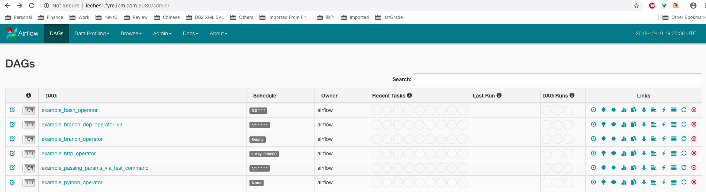

# Evaluate Apache Airflow

[Airflow](https://airflow.apache.org/) is a platform to programmatically author, schedule and monitor workflows.

The workflow is defined as a DAG. The `scheduler` executes the tasks following the dependencies. Provides rich command line utilities and user interface.

To compare with Kubeflow Pipeline, a workflow DAG is a pipeline.

Current version 1.10.1 released on Nov 21, 2018.

## Core concepts

* **DAGs** - The specification of a workflow, the collection of all the tasks with dependencies and relationships. A DAG can contain SubDAGs.

* **SubDAGs** - Perfect for repeating patterns. Defining a function that returns a DAG object is a nice design pattern when using Airflow.

* **Operators** - DAG defines how to run a workflow while Operators determine what actually get done. An operator is assigned with a DAG. Usually it is standalone (or atomic) and run independently from other operators. Data does not move from one task to another. `XCom` is provided for between-operators communication if needed.

* **Sensors** - Sensor is a special type of operator. Sensor operators keep executing at a time interval and succeed when a criteria is met and fail if and when they time out.

* **Workflows** - Combining DAGs, Operators to create Task Instances (explained later), you can build complex workflows.

## Runtime concepts

* **Tasks** - A parameterized instance of an operator.

* **Task Instances** - A specific run of a task, has been assigned to a DAG, has status "running", "success", "failed", "skipped", "up for retry" etc.

* **DAG run** - A scheduled or triggered run of a workflow.

* **Scheduler** - Central point of workflow and task scheduler. When a DAG is defined, it can specify the interval and trigger rules. The scheduler monitors all tasks and all DAGs, and triggers the task instances whose dependencies have been met. Behind the scenes, it monitors and stays in sync with a folder for all DAG objects it may contain, and periodically (every minute or so) inspects active tasks to see whether they can be triggered.

* **Executors** - Define whether tasks within a workflow will be run sequential or in parallel. In a sequential way, each task is run as a child process of the scheduler. To scale out, choose `Celery` backend (with CeleryExecutor) or run directly on `Mesos` slaves (with MesosExecutor).

## Pipeline definitions

DAGs, aka pipelines, are written in Python. A workflow is an object of base **DAG** class. In the same Python code, create Operator objects and assign them to the DAG object. Relationship among operators is defined through functions `set_upstream`, `set_downstream` and others. Here is an example:

```python
from airflow import DAG
from airflow.operators.bash_operator import BashOperator
from datetime import datetime, timedelta

default_args = {
    'owner': 'airflow',
    'depends_on_past': False,
    'start_date': datetime(2015, 6, 1),
    'email': ['airflow@example.com'],
    'email_on_failure': False,
    'email_on_retry': False,
    'retries': 1,
    'retry_delay': timedelta(minutes=5)
}

# instantiate a DAG
dag = DAG('tutorial', default_args=default_args, schedule_interval=timedelta(days=1))

# t1, t2 and t3 are examples of tasks created by instantiating operators
# each operator object is assigned to the dag object
t1 = BashOperator(
    task_id='print_date',
    bash_command='date',
    dag=dag)

t2 = BashOperator(
    task_id='sleep',
    bash_command='sleep 5',
    retries=3,
    dag=dag)

templated_command = """
    
        echo "{{ ds }}"
        echo "{{ macros.ds_add(ds, 7)}}"
        echo "{{ params.my_param }}"
    
"""

t3 = BashOperator(
    task_id='templated',
    bash_command=templated_command,
    params={'my_param': 'Parameter I passed in'},
    dag=dag)

# build the relationship/dependencies among operators
t2.set_upstream(t1)
t3.set_upstream(t1)
```

## Operators

Operator is the basic building block of a pipeline. The top level abstract class is `BaseOperator`. Some core operators are:

* BashOperator - Execute *bash* scripts.
* PythonOperator, BranchPythonOperator - Execute *python* codes.
* DockerOperator - Execute a command inside a *docker container*.
* GenericTransfer - Move data from one connection to another.
* S3FileTransformOperator - Move data from S3 to local and transform.

Airflow's `plugins` mechanism allows external features to be added to its core by simply dropping python modules in the *plugins* folder. Hence developers may contribute all sorts of `Operators` available for use. Following are some community contributed operators:

* AWSBatchOperator - Execute a workflow on AWS Batch Service.
* BigQueryOperator - A set of operators for querying data on BigQuery database.
* DatabricksSubmitRunOperator - Submit a Spark job to run on Databricks Runtime.
* DataFlowJavaOperator, DataFlowPythonOperator - Run DataFlow batch jobs.
* DataProcClusterCreateOperator, DataProcClusterScaleOperator, DataProcClusterDeleteOperator - Manage Google Cloud Dataproc.
* DataProcSparkOperator, DataProcPySparkOperator - Start a Spark job on Google Cloud Dataproc cluster.
* DataProcHadoopOperator - Start a Hadoop job on Google Cloud Dataproc cluster.
* EmrCreateJobFlowOperator, EmrTerminateJobFlowOperator, EmrAddStepsOperator - Manage EMR Job Flow.
* GKEClusterCreateOperator, GKEClusterDeleteOperator - Manage GKE cluster.
* KubernetesPodOperator - Execute a task in a Kubernetes pod
* MLEngineModelOperator, MLEngineBatchPredictionOperator, MLEngineVersionOperator, MLEngineTrainingOperator - Perform ML tasks on Google ML Engine.
* SageMakerBaseOperator, SageMakerEndpointOperator, SageMakerModelOperator, SageMakerTrainingOperator, SageMakerTransformOperator, SageMakerTuningOperator - Deep learning with SageMaker.

## Behind the scenes

Airflow uses a database to store all the metadata. Out of box is Sqlite which is very limited and only allows running tasks sequentially (no parallelism support). However, it can also be configured to use any other SqlAlchemy compliant databases, such as MySql and Postgres.

Airflow provides `connections` and `hooks` support that specify how to connect to data sources. For example, if using cloud compose database, the connection string can be added and created a connection id to be used by any operators in a DAG.

Airflow installation is quick and easy. It is provided as a Python package and can be installed with `pip` tool. The default `apache-airflow` package is very basic. But it also offers subpackages for other features, see the [installation doc](https://airflow.apache.org/installation.html). Some options are `all`, `all_dbs`, `hdfs`, `gcp_api`, `mysql`, `postgres`, `s3`, `cloudant`.

Airflow is installed to *$AIRFLOW_HOME* directory and the configuration is kept in the *airflow.cfg* file. Once installed, the first thing is to initiate the database followed by starting the scheduler. UI backend may also be started. Tasks can be run through command line or UI.

```command line
airflow initdb
airflow scheduler&
airflow webserver -p 8080&
```

## User Interface

Airflow UI is very rich and powerful.



From the UI, you can view the DAGs, the task status, logs, as well as manage connections etc. It is the most advanced workflow management UI compared with other open source projects such as mlflow, kubeflow pipeline, pachyderm.

## Command Line Interface

Airflow supports manage, schedule, run, monitor and others operations through `airflow` command.

```text
airflow [-h] {version, initdb, upgradedb, delete_dag, task_state, list_dags, resetdb, create_user, webserver, pool, scheduler, serve_logs, clear, trigger_dag, test, connections, worker, kerberos, pause, task_failed_deps, render, run, list_tasks, backfill, dag_state, variables, flower, unpause} ...
```

## Experimental Rest API

Restful APIs are not there yet.

* GET /api/experimental/dags/<DAG_ID>/tasks/<Task_ID>
* POST /api/expermiental/dags/<DAG_ID>/dag_runs

## Possible AISphere Integration

Unlike Pachyderm or Kubeflow Pipeline, Airflow does not need to deploy to a k8s cluster. This gives it more flexibility while the tasks can be still scheduled to run on k8s containers through existing or custom operators.

Airflow's workflow management may be viewed as a higher level tool on task scheduling and monitoring. Tasks are tracked with status. But on the other hand, data scientists and AIOps may be more interested in the metrics or logs from the models run in a task.

To track operations on AISphere with Airflow, one approach is to use the existing `BashOperator` and `PythonOperator` to invoke either CLI or Rest APIs to schedule the tasks to run on AISphere (including FfDL) clusters. Another approach is to contribute AISphere's version of AI/ML operators, just like what Google, Amazon and others have done.
