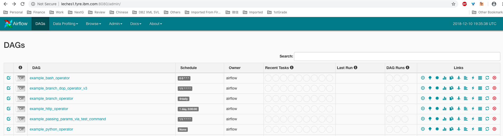

# Evaluate Apache Airflow

[Airflow](https://airflow.apache.org/) is a platform to programmatically author, schedule and monitor workflows.

The workflow is defined as a DAG. The `scheduler` executes the tasks following the dependencies. Provides rich command line utilities and user interface.

* `pipeline` Python code
* `scheduler`, `operator`, `executor`
* `parameter`

Data does not move from one task to another.

Current version 1.10.1 released on Nov 21, 2018.

```command line
airflow initdb
airflow webserver -p 8080&
airflow scheduler&
```

In $AIRFLOW_HOME directory, database `airflow.db` (sqlite), `airflow.cfg` are created.

The out of box sqlite database is very limited and only allows running tasks sequentially (no parallelism support).

Use the `airflow run` command to run a task. Or run the task through the UI.

Airflow UI 

airflow also has extra features like `s3` and `postgres` (instead of the default sqlite).

```command line
pip install "apache-airflow[s3, postgres]"
```

It also offers subpackages for other features, see the [installation doc](https://airflow.apache.org/installation.html). Some options are `all`, `all_dbs`, `hdfs`, `gcp_api`, `mysql`, `postgres`, `s3`, `cloudant`.

## Pipeline definition

Pipeline is written in Python, specified the configuration as a DAG. Each individual `task` will run on different `worker` at different point in time.

```command line
python ~/airflow/dags/tutorial.py
airflow list_dags
airflow list_tasks tutorial
airflow list_tasks tutorial --tree
airflow test tutorial print_date 2015-06-01
```

## Operators

* BashOperator

* PythonOperator

* EmailOperator

* SimpleHttpOperator

* Google Cloud Platform Operators

* HiveOperator

* MySqlOperator, SqliteOperator, PostgresOperator, MsSqlOperator, OracleOperator, JdbcOperator

* Sensor

* DockerOperator

* S3FileTransformOperator

* PrestoToMySqlOperator

* SlackOperator

* BranchPythonOperator

Allow remote logging.

Tasks will be executed as subprocesses of scheduler if it is `LocalExecutor`.

## Scaling out

* Set up Celery backend (RabbitMQ, Redis, ...) to scale out the number of workers. (CeleryExecutor)

* Dask.

* Mesos. Running airflow tasks directly on mesos slaves. (MesosExecutor)

To install `gcc`:

```command line
apt-get install build-essential
```

## Concepts

* DAGs - Collection of all the tasks with dependencies and relationships.
* Scope - global vs local. Only the DAG in the global scope will be loaded.
* Default Arguments
* Context Manager
* Operators - DAG defines how to run a workflow, Operators determine what actually get done. An operator is a single task in a workflow. Usually is standalone (or atomic) and run independently from other operators. `XCom` is implemented for between-operators communication if needed.
* DAG Assignment
* Bitshift Composition
* Tasks - A parameterized instance of an operator, it is referred to as a `task`.
* Task Instances - A specific run of a task, has been assigned to a DAG, has status "running", "success", "failed", "skipped", "up for retry" etc.
* Workflows - Combining DAGs, Operators to create Task Instances, you can build complex workflows.
* Hooks - Interface to external platforms and databases.
* Pools - Limit the execution parallelism on arbitrary sets of tasks.
* Connections
* Queues
* XComs
* Variables
* Branching
* SubDAGs - Perfect for repeating patterns. Defining a function that returns a DAG object is a nice design pattern when using Airflow.
* SLAs - Service level Agreements
* Trigger Rules
* Latest Run Only
* Zombies and Undeads
* Cluster Policy
* Documentation and Notes
* Jinja Templating
* Packaged DAGs

## Data profiling
(Not so related.)

## CLI

## Scheduling and Triggers

The Airflow scheduler monitors all tasks and all DAGs, and triggers the task instances whose dependencies have been met. Behind the scenes, it monitors and stays in sync with a folder for all DAG objects it may contain, and periodically (every minute or so) inspects active tasks to see whether they can be triggered.

## Plugins
